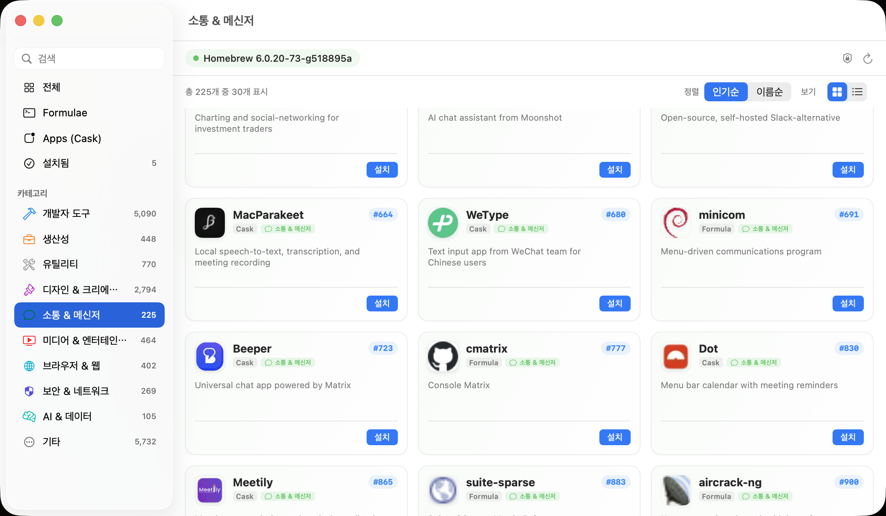

🇰🇷 [한국어](README.md) | 🇺🇸 [English](README.en.md) | 🇯🇵 [日本語](README.ja.md) | 🇨🇳 [中文](README.zh.md)

<p align="center">
  
</p>

<h1 align="center">Brew Manager</h1>

<p align="center">
  <a href="https://brew.sh">Homebrew</a> パッケージを直感的に管理できるmacOSネイティブGUIアプリ
</p>

<p align="center">
  
</p>

## 主な機能

- **App StoreスタイルのGUI**: グリッドカードとリストビューの切り替え、おすすめアプリシェルフ、カテゴリーブラウジング
- **10のスマートカテゴリー**: 開発ツール、生産性、ユーティリティ、デザイン、コミュニケーション、メディア、ブラウザ、セキュリティ、AI＆データ、その他
- Homebrewのインストール状態を自動検知し、未インストールの場合はワンクリックで導入
- 8,500以上のFormulaと7,700以上のCaskを人気順に探索可能
- キーワード即時検索対応
- ワンクリックでインストール、アンインストール、一括アップデート

## インストール

### Homebrew
```bash
brew tap mrKangHo/tap
brew install brew-manager
```
