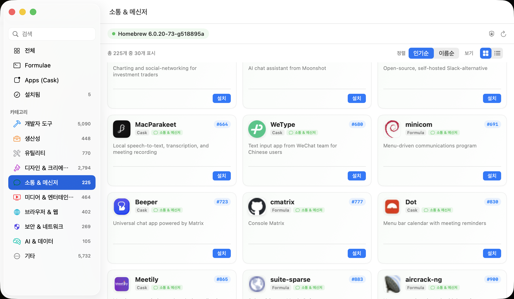

<p align="center">
  
</p>

<h1 align="center">Brew Manager</h1>

<p align="center">
  <a href="https://brew.sh">Homebrew</a> 패키지를 설치하고 관리하는 macOS 네이티브 GUI 앱
</p>

<p align="center">
  <a href="README.md">English</a> ·
  <a href="README.ko.md">한국어</a> ·
  <a href="README.ja.md">日本語</a> ·
  <a href="README.zh-Hans.md">中文</a>
</p>

<p align="center">
  
</p>

## 기능

- **App Store 스타일 그래픽 GUI**: 그리드 카드 & 리스트 뷰 전환, 추천 앱 쉘프, 카테고리 브라우징 제공
- **10개 지능형 카테고리 분류**: 개발자 도구, 생산성, 유틸리티, 디자인, 소통, 미디어, 브라우저, 보안, AI & 데이터, 기타
- Homebrew 설치 여부를 자동 감지하고, 미설치 시 공식 스크립트로 원클릭 설치
- Homebrew 전체 카탈로그(포뮬러 8,500개+, 캐스크 7,700개+)를 formulae.brew.sh의 실제 설치 통계 기준 인기순 탐색
- 키워드 실시간 즉시 검색 및 엔터 검색 지원
- 원클릭 설치 · 삭제 · 업데이트 및 전용 **업데이트 메뉴**를 통한 전체 업데이트 지원
- 항목 클릭 시 설명 · 홈페이지 링크 · 카테고리 뱃지 · 설치 상태를 보여주는 상세 화면 이동
- 한국어 · 영어 · 일본어 · 중국어(간체) 완전 다국어 지원 (macOS 시스템 언어 자동 반영)

## 설치

### Homebrew (권장)

```bash
brew tap mrKangHo/brew-manager https://github.com/mrKangHo/brew-manager
brew install --cask brew-manager
```

### 수동 설치

[Releases](../../releases) 페이지에서 최신 빌드를 받아 압축을 풀고 `Brew Manager.app`을 `/Applications`로 옮기세요.

Apple 공증(notarization)을 받지 않은 빌드라 첫 실행 시 macOS Gatekeeper가 막습니다. 다음 중 하나로 여세요:

1. `Brew Manager.app` 우클릭 → **열기** → 대화상자에서 다시 **열기**, 또는
2. 터미널에서 실행: `xattr -cr "/Applications/Brew Manager.app"`

## 요구 사항

- macOS 14(Sonoma) 이상
- [Homebrew](https://brew.sh) (없으면 앱이 설치해줌)

## 소스에서 빌드

```bash
git clone https://github.com/mrKangHo/brew-manager.git
cd brew-manager
./scripts/build-app.sh
open "dist/Brew Manager.app"
```

Xcode Command Line Tools(Swift 5.9+) 필요.

## 안내

이 앱은 비공식 서드파티 클라이언트입니다. Homebrew 프로젝트와 관련이 없습니다.

## 라이선스

MIT
